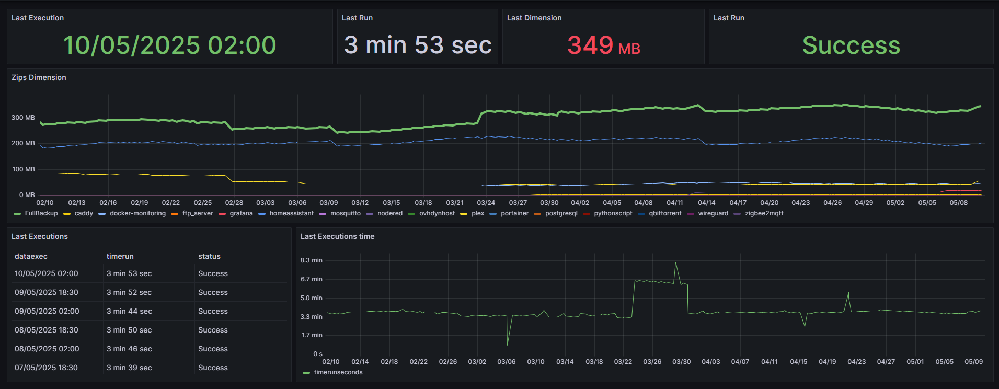

# 🛡️ Automated Backup 🛡️

This project backs up specified directories, compresses the data (with optional password), uploads it to Google Drive, and logs the operations in a PostgreSQL database. Everything is containerized using Docker.

## 🧰 Features

- 🔐 Single or full backups with password-protected ZIP (AES) support.
- ☁️ Upload to Google Drive via OAuth2 API.
- 🧹 Automatic deletion of old files on Drive (configurable).
- 🗄️ Operation logging in PostgreSQL.
- 🐳 Isolated execution via Docker.

## 📝 Configuration (`config.json`)

The `config.json` file defines:

- Folders to include in the backups
- Credentials and options for Google Drive
- Logging settings for the PostgreSQL database
- [Config Example](CONFIG_EXAMPLE.json)

### 🔍 Field Descriptions

#### `backups`

- `path`: path to the folder to be compressed
- `zip_name`: name of the ZIP archive
- `filters.include` / `filters.exclude`: patterns to include or exclude files (supports `*` and subfolders) -> [Filter Usage Link](CONFIG_FILTER.en.md)

#### `googledrive`

- `backup_name`: base name of the full backup
- `key_dir_drive`: ID of the destination folder on Google Drive. It's an alphanumeric code found in the drive link (e.g., https://drive.google.com/drive/folders/1WRdKfvjU2fUIkJ6XXXXXXXX-H7TxTd). Only the code "1WRdKfvjU2fUIkJ6XXXXXXXX-H7TxTd" should be provided.
- `password_zip`: password for the ZIP file (optional but strongly recommended)
- `delete_old_file_days`: delete files older than X days from Google Drive

#### `postgresql`
- `host`: PostgreSQL server host
- `dbname`: database name
- `schema`: name of the database schema
- `user`: username for accessing the database
- `password`: password for accessing the database
- `enabled`: [true|false] to indicate whether to use database logging

### ⚙️ PostgreSQL Setup

To log backup operations into a PostgreSQL database, you need to configure your database following the instructions in the PostgreSQL configuration file. This is especially useful if you want to integrate the data into **Grafana** reports.

- You can find the PostgreSQL setup instructions here [POSTGRESQL.en.md](POSTGRESQL.en.md).

Using PostgreSQL is **required** to monitor and visualize the operations via **Grafana**.

# 🐳 Docker Compose Configuration

This project uses **Docker** to run the automated backup inside an isolated container, making installation and execution easy across systems.

## 📝 Prerequisites

Before running the project, make sure you have **Docker** and **Docker Compose** installed. You can follow the official installation guides:

- [Install Docker](https://docs.docker.com/get-docker/)
- [Install Docker Compose](https://docs.docker.com/compose/install/)

## 🔧 Docker Compose Configuration

The `docker-compose.yml` file defines the services needed for the project to run. The main service is the automated backup, which connects to your **Google Drive** and **PostgreSQL**.

### Example `docker-compose.yml`

```yaml
services:
  automated-backup:
    image: andreacocco/automated-backup:latest
    container_name: automated-backup
    volumes:
      - ./log:/app/log  # Maps the project's log folder
      - ./config.json:/app/config.json # Maps the project's config.json
      - /c/credential:/app/credential # Maps the credential folder containing credential.json and token.json
      # On Windows, paths must be prefixed with "/c/". Example:
      - /c/temporary:/c/temporary  # For Windows
      # On Linux, paths are mounted normally. Example:
      - /srv/docker-projects/:/srv/docker-projects/:ro  # For Linux (read-only)
```

### 🔄 Start the Service

To start the container, run the following command in the directory containing `docker-compose.yml`:

```bash
docker-compose up --build
```

This command builds (if needed) and starts the service. Once the container is running, the backup will be executed automatically based on the `config.json` settings.

### 🛠️ Volumes and Config

Make sure the following folders and files are correctly configured:

1. **`config.json`**: Defines which folders to back up and credentials for Google Drive and PostgreSQL.
2. **`log/` folder**: Logs will be written here.
3. **Target folders**: Ensure the folders you want to back up are present.

## 📊 Monitoring with Grafana

To monitor the backup operations in real time, you can use **Grafana** connected to the PostgreSQL database used by this project.

### ✅ Requirements

- PostgreSQL must be **enabled** (`"enabled": true` in `config.json`)
- The logging table must be present as per [`POSTGRESQL.en.md`](POSTGRESQL.en.md)

### 🧭 Preconfigured Grafana Dashboard

A ready-to-use Grafana dashboard has been created and can be imported directly into your Grafana environment:

  
🔗 [Import this dashboard](Grafana_Dashboard.json)

> 💡 Tip: after importing, update the PostgreSQL datasource from the "Datasource" dropdown menu.

### ⚙️ Connecting Grafana to PostgreSQL

1. Log in to your Grafana instance
2. Go to **Connections → Data sources**
3. Add a new **PostgreSQL** datasource with the following parameters (as per `config.json`):
   - **Host**: e.g., `localhost:5432`
   - **Database**: value from `dbname`
   - **User/Password**: as configured
   - **SSL**: Disabled (unless using a secure connection)

4. Click **Save & Test**

Once configured, you can:
- Import the provided dashboard
- Create new queries to analyze backup frequency, errors, operation duration, and more

## 📅 Scheduled Backup Automation

To automatically schedule the start of the `automated-backup` container every day (e.g., at 02:00 and 18:30), refer to the guide:

📄 [How to schedule the backup with Home Assistant or Node-RED](AUTOMATION.en.md)
