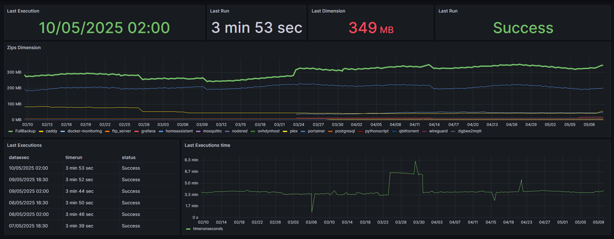

# 🛡️ Automated Backup 🛡️

Questo progetto esegue il backup di directory specificate, comprime i dati (anche con password opzionale), li carica su Google Drive e registra le elaborazioni in un database PostgreSQL. Il tutto è containerizzato con Docker.

## 🧰 Funzionalità

- 🔐 Backup singoli o completi con supporto ZIP con password (AES).
- ☁️ Upload su Google Drive tramite API OAuth2.
- 🧹 Pulizia automatica dei file vecchi su Drive configurabile.
- 🗄️ Tracciamento delle elaborazioni su PostgreSQL.
- 🐳 Esecuzione isolata via Docker.

## 📝 Configurazione (`config.json`)

Il file `config.json` definisce:

- Le cartelle da includere nei backup
- Le credenziali e opzioni per Google Drive
- Le impostazioni per il tracciamento su database PostgreSQL
-  [Config Example](CONFIG_EXAMPLE.json)

### 🔍 Descrizione dei campi

#### `backups`

- `path`: percorso della cartella da comprimere
- `zip_name`: nome dell'archivio ZIP
- `filters.include` / `filters.exclude`: pattern per includere o escludere file (supporta `*` e sottocartelle) -> [Link Utilizzo Filtro](CONFIG_FILTER.it.md)

#### `googledrive`

- `backup_name`: nome base del backup completo
- `instance`: Nome istanza Google Drive per gestire caricamenti multipli (nome a piacere)
- `key_dir_drive`: ID della cartella di destinazione su Google Drive. E' un codice alfanumerico presente nel link di accesso a drive (es.https://drive.google.com/drive/folders/1WRdKfvjU2fUIkJ6XXXXXXXX-H7TxTd). Dovrà essere indicato solo il codice "1WRdKfvjU2fUIkJ6XXXXXXXX-H7TxTd")
- `password_zip`: password del file ZIP (opzionale, ma fortemente consigliata)
- `delete_old_file_days`: elimina file più vecchi di X giorni su Google Drive
- `zip_type`: "zip" per maggior velocità, "tar.xz" per maggior compressione. 

#### `postgresql`
- `host`: host del server postgresql
- `dbname`: nome del database
- `schema`: nome dello schema del database
- `user`: username per l'accesso al database
- `password`: password per l'accesso al database
- `enabled`: [true|false]  per indicare se utilizzare o no il logging database

### ⚙️ Configurazione di PostgreSQL

Per utilizzare il logging delle elaborazioni nel database PostgreSQL, dovrai configurare il tuo database seguendo le istruzioni nel file di configurazione PostgreSQL. Questo è particolarmente utile se desideri integrare i dati per la reportistica su **Grafana**.

- Puoi trovare le istruzioni per la configurazione di PostgreSQL in questo [link](POSTGRESQL.it.md).
  
L'uso di PostgreSQL è **necessario** per poter monitorare e visualizzare le elaborazioni tramite **Grafana**.

# ⚙️ Creazione credenziali Google Drive

Le credenziali Google Drive sono ovviamente necessarie per poter caricare i propri backup su Drive.
Vi consiglio l'utilizzo di questo tool [google-oauth-token-generator](https://github.com/CoccoAndrea/google-oauth-token-generator/tree/main) in modo da avere "credential.json" e "token.json".

**I due file andranno poi depositati in una cartelle e mappata tramite docker-compose.**

La cartella delle credenziali deve contenere all'interno N sottocartelle (una per ogni istanza google drive creata). In ogni sottocartella saranno presenti credentials e token.
# 🐳 Configurazione Docker Compose

Questo progetto utilizza **Docker** per eseguire il backup automatico in un contenitore isolato, facilitando l'installazione e l'esecuzione su qualsiasi sistema.

## 📝 Pre-requisiti

Prima di eseguire il progetto, assicurati di avere **Docker** e **Docker Compose** installati sul tuo sistema. Puoi seguire le guide ufficiali per l'installazione:

- [Installazione Docker](https://docs.docker.com/get-docker/)
- [Installazione Docker Compose](https://docs.docker.com/compose/install/)

## 🔧 Configurazione di Docker Compose

Il file `docker-compose.yml` definisce i servizi necessari per l'esecuzione del progetto. Il servizio principale è il backup automatizzato che si connette al tuo **Google Drive** e **PostgreSQL**.

### Esempio di `docker-compose.yml`

```yaml
services:
  automated-backup:
    image: andreacocco/automated-backup:latest
    container_name: automated-backup
    volumes:
      - ./log:/app/log  # Mappa la cartella log del progetto
      - ./config.json:/app/config.json # Mappa il file config.json del progetto
      - /c/credential:/app/credential # Mappa la cartella credential del progetto contenente il credential.json e token.json
      # Su Windows, i percorsi devono essere preceduti da "/c/". Ad esempio, per la cartella "temporary"
      # mappiamo la cartella locale "C:	emporary" alla cartella "/c/temporary" nel contenitore.
      - /c/temporary:/c/temporary  # Per Windows
      # Su Linux, i percorsi sono montati normalmente. Ad esempio, mappiamo la cartella "/srv/docker-projects"
      # alla stessa directory nel contenitore. Usa ":ro" per montare la cartella in sola lettura.
      # In questo caso, la cartella è montata come "read-only" (ro).
      - /srv/docker-projects/:/srv/docker-projects/:ro  # Per Linux
```

### 🔄 Avvio del servizio

Per avviare il container, esegui il seguente comando nella directory dove si trova il file `docker-compose.yml`:

```bash
docker-compose up --build
```

Questo comando costruisce (se necessario) e avvia il servizio. Dopo che il contenitore è in esecuzione, il backup verrà eseguito automaticamente secondo le configurazioni nel file `config.json`.

### 🛠️ Volumi e configurazioni

Assicurati che le seguenti cartelle e file siano correttamente configurati:

1. **`config.json`**: Il file di configurazione che definisce quali cartelle includere nei backup e le credenziali per Google Drive e PostgreSQL.
2. **Cartella `log/`**: I log verranno scritti in questa cartella.
3. **Cartelle di destinazione**: Assicurati che le cartelle che dovranno essere backupate

## 📊 Monitoraggio con Grafana

Per monitorare le elaborazioni dei backup in tempo reale, puoi utilizzare **Grafana** collegandolo al database PostgreSQL utilizzato da questo progetto.

### ✅ Requisiti

- PostgreSQL **deve essere attivato** (`"enabled": true` in `config.json`)
- La tabella di log dev'essere presente secondo lo schema fornito in [`POSTGRESQL.it.md`](POSTGRESQL.it.md)

### 🧭 Dashboard Grafana pronta all’uso

Ho creato una dashboard Grafana già configurata, che puoi importare direttamente nel tuo ambiente Grafana:


🔗 [Importa questa dashboard](Grafana_Dashboard.json)


> 💡 Consiglio: dopo l'importazione, modifica la connessione al datasource PostgreSQL dal menu a tendina "Datasource".

### ⚙️ Collegamento di Grafana al PostgreSQL

1. Accedi alla tua istanza di Grafana
2. Vai su **Connections → Data sources**
3. Aggiungi un nuovo **PostgreSQL** datasource con i seguenti parametri (modificali secondo `config.json`):
   - **Host**: ad esempio `localhost:5432`
   - **Database**: il nome indicato nel campo `dbname`
   - **User/Password**: come da configurazione
   - **SSL**: Disabilitato (a meno che tu non usi una connessione sicura)

4. Clicca **Save & Test**

Una volta configurato, puoi:
- Importare la dashboard fornita
- Creare nuove query su Grafana per analizzare frequenza backup, errori, durata operazioni, ecc.

## 📅 Automazione backup programmato

Per pianificare automaticamente l’avvio del container `automated-backup` ogni giorno (ad esempio alle 02:00 e alle 18:30), consulta la guida:

📄 [Come schedulare il backup con Home Assistant o Node-RED](AUTOMATION.it.md)